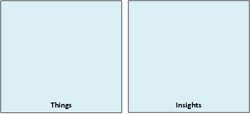

# LAB04 - Connect an IoT Device to Azure
## Lab Scenario
Contoso is known for producing high quality cheeses. Due to the company's rapid growth in both popularity and sales, they want to take steps to ensure that their cheeses stay at the same high level of quality that their customers expect. Therefor they have decided to launch an automated system that uses IoT devices to monitor temperature and humidity. The rate at which telemetry data is communicated will be adjustable to help ensure that their manufacturing process is under control as batches of cheese proceed through environmentally sensitive processes.

## In this lab
In this lab, you will learn how to register, configure and run a simulated device to send Device-to-Cloud telemetry messages.



## Prerequisites
This lab assumes that you have the following resources available:

Resource Type | Resource Name
--------------|--------------
Resource Group | AZ-220-RG
IoT Hub | AZ-220-HUB-*{YOUR-ID}*

### **Exercise 1: Create an Azure IoT Hub Device ID using Azure CLI**
The Azure CLI modules include several commands for managing IoT Devices within Azure IoT Hub under the `az iot hub device-identity` command group. These commands can be used to manage IoT Devices within scripts or directly from the command-line / terminal.
- Inside an Azure Cloud Shell, make sure you have the latest IoT Extension installed:
  ```sh
  az extension add --name azure-cli-iot-ext
  ```
- Inside the Azure Cloud Shell, now create a new Device Identity in your IoT Hub:
  ```sh
  az iot hub device-identity create --hub-name {IoTHubName} --device-id SimulatedDevice1
  az iot hub device-identity show-connection-string --hub-name {IoTHubName} --device-id SimulatedDevice1 --output table
  ``` 
### **Exercise 2: Configure the Device (using C#)**
You will now configure a simuated device written in C# to connect to your Azure IoT Hub using the Device ID and Shared Access Key created in exercise 1.
- Using Visual Studio Code, in the /LabFiles folder for this lab, open the SimulatedDevice.cs file
- Add your connection string to the SimulatedDevice.cs file
- Run the simulated device from within the Visual Studio Code terminal
### **Exercise 3: Verify the Telemetry Stream sent to your Azure IoT Hub**
You will again use the Azure CLI, but this time to verify telemetry sent by your simulated device.
- Inside an Azure Cloud Shell, run the following command to view D2C messages being sent to the Azure IoT Hub endpoint:
  ```sh
  az iot hub monitor-events --hub-name {IoTHubName} --device-id SimuatedDevice1
  ```
This concludes LAB04. If you want to have more detailed instructions for the lab, complete step-by-step instructions are [available here](https://github.com/MicrosoftLearning/AZ-220-Microsoft-Azure-IoT-Developer/blob/master/Instructions/Labs/LAB_AK_04-connect-iot-device-to-azure.md).