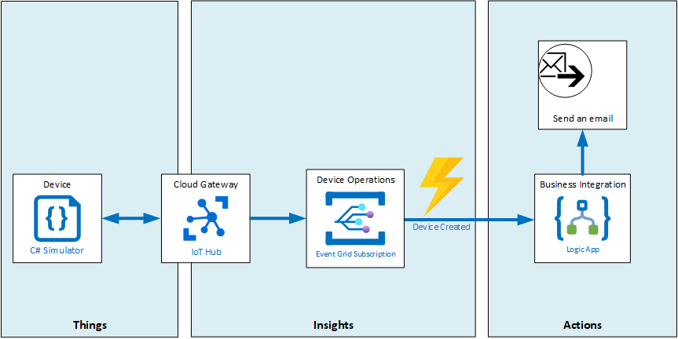

# Integrate IoT Hub with Event Grid
Contoso is installing new connected Thermostats to be able to monitor temperature across different cheese caves. You will create an alert to notify facilities manager when a new thermostat has been created.

More about alerts

To create an alert, you will use the Event Grid Service when a new thermostat is created in IoT Hub. You will use a Logic Apps instance that reacts on creating new devices (through Event Grid Service events) by sending an email to alert a facilities manager each time a new device has been created, sharing the device ID and connection state.

## In this lab
In this lab, you will learn to create a Logic App that sends an email, configure Azure IoT Hub Event Subscriptions and create devices that will trigger the Logic App to send emails.

## Prerequisites
This lab assumes that you have the following resources available:

Resource Type | Resource Name
--------------|--------------
Resource Group | AZ-220-RG
IoT Hub | AZ-220-HUB-*{YOUR-ID}*

### **Exercise 1: Create a HTTP Web Hook Logic App that sends an email**
In this exercise you will create a new [Azure Logig App](https://azure.microsoft.com/en-us/services/logic-apps/) that will be triggered via a HTTP Web Hook, each time an IoT Hub sends an event to the Event Grid Service when a new particular device is created. The Azure Logic App will send an email to an Outlook.com email address when it is triggered.
- Create a new Logic App in your Resource Group and give it a unique name (for instance **AZ-220-LogicApp-CP-_"{YOUR-ID}"_**)
- Make sure to trigger the Logic App **When a HTTP request is received**.
- In the **Request Body JSON Schema** textbox, past in a **DeviceCreated** sample event schema, that can be found in the [Event Schema IoT Hub documentation](https://docs.microsoft.com/en-us/azure/event-grid/event-schema-iot-hub). Event Grid will post an event to the Web Hook endpoint for the Logic App.
- Add a New step to the Logic App to send an email, using the **Send an email (V2) (Preview)** action for the **Outlook.com** connector.
- Fill in `IoT Hub alert:` as email subject
- Fill in the following content (using a mix of fixed and dynamic content):
  `This is an automated email to inform you that: {eventType} occurred at {eventTime} for IoT Hub: {hubName} with Device ID: {deviceID} and Connection state: {connectionState}.`
- Save the changes in the Logic App Workflow.
- Save the **HTTP POST URL** that is displayed, Event Grid will use this URL to trigger the execution of the Logic App Workflow.

### **Exercise 2: Configure the Azure IoT Hub Event Subscription**
Azure IoT Hub integrates with Azure Event Grid so that you can send event notifications to other services and trigger downstream processes. You can configure business applications to listen for IoT Hub events so that you can react to critical events in a reliable, scalable, and secure manner.

In this exercise, you will create an Event Subscription within Azure IoT Hub to setup Event Grid integration that will trigger the Logic App you created in excersize 1 to send an alert email.
- On the **AZ-220-HUB-_{YOURID}_** IoT Hub, create an event subscription with name `MyDeviceCreateEvent` and EventSchema `Event Grid Schema`.
- Filter out all events except for **Device Created**.
- Select the **Web Hook** Endpoint Type and paste the **HTTP POST URL** under **Subscriber Endpoint**.
- Prior to creating the event subscription, add filters for devices that begin with `devices/CheeseCave1_` and that end with `_Thermostat`.

### **Exercise 3: Test your Logic App by creating New Devices in your IoT Hub**
- Create the following devices from the IoT Hub explorer:
  - CheeseCave1_Building1_Light
  - CheeseCave2_Building1_Thermostat
  - CheeseCave2_Building2_Light

This concludes LAB09. If you want to have more detailed instructions for the lab, complete step-by-step instructions are [available here](https://github.com/IoTForDevices/AZ-220-Microsoft-Azure-IoT-Developer/blob/master/Instructions/Labs/LAB_AK_09-iot-hub-integration-with-azure-event-grid.md).
