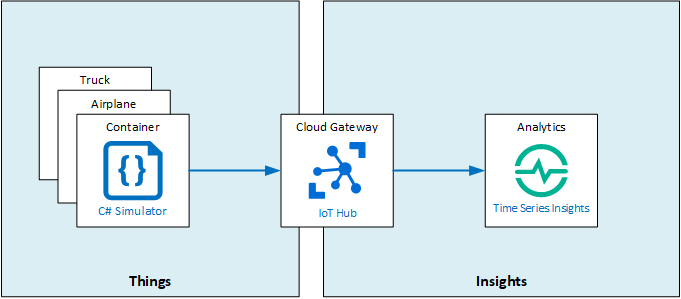

# Explore and analyze time stamped data with Time Series Insight
Contoso's asset condition tracking revealed a spike in temperature for a specific asset, and we want to find the root cause. We want to understand what happened: we correlate the IoT device's sensor data from transportation trucks and planes sensors.

You will add Time Series Insights to the solution to quickly store, visualize, and query large amounts of time series data, that are generated by the IoT devices in the trucks, planes, and the transport boxes themselves to visualize changes over time. This can help you to explore data in near real time and perform root-cause analysis to help with improving delivery processes to ensure products are kept in the best condition.

## In this lab
In this lab, you will learn to create an Azure Time Series Insights (TSI) environment, connect an IoT Hub with TSI and to view TSI data with TSI Explorer.

## Prerequisites
This lab assumes that you have the following resources available:

esource Type | Resource Name
--------------|--------------
Resource Group | AZ-220-RG
IoT Hub | AZ-220-HUB-*{YOUR-ID}*
Device ID | TruckDevice
Device ID | AirplaneDevice
Device ID | ContainerDevice

> NOTE: If you don't have created the TruckDevice, AirplaneDevice and / or ContainerDevice yet, you can create them either through the Azure portal or in the Azure CLI.

### **Exercise 1: Setup Time Series Insights**
Azure Time Series Insights (TSI) is an end-to-end platform-as-a-service (PaaS) offering used to collect, process, store, analyze, and query data from Internet of Things (IoT) solutions at scale. TSI is designed for ad hoc data exploration and operational analysis of data that's highly contextualized and optimized for time series.

In this exercise, you will setup Time Series Insights (TSI) integration with Azure IoT Hub.

- Using the Azure Portal, create a Time Series Insight with **Environment name** set to **AZ-220-TSI** in the same Azure region where your Resource Group is located.
- Select the **S1** pricing tier with the **Capacity** set to 1.
- Create a new Event Source on TSI with the unique name **AZ-220-TSI-_{YOUR_ID}_**.
- Select your existing IoT Hub as event source.
- Make sure to create a new CONSUMER GROUP with the name **tsievents** and create the new TSI deployment.

### **Exercise 2: Run Simulated IoT Devices**
In this exercise, you will run the simulated devices so they start sending telemetry events to Azure IoT Hub.

- Using Visual Studio Code, in the /LabFiles folder for this lab, open the SimulatedDevice.cs file
- Add your connection strings for Truck, Airplane and Container
- Run the simulated device from within the Visual Studio Code terminal and leave it running.

### **Exercise 3: View data in Time Series Insight Explorer**
- Open the **Time Series Insight Explorer** from your Azure Portal
- Show temperature values, split by iothub-connection-device-id and enable Auto Refresh.
- Repeat the previous step to display humidity data

Once you have completed exploring the data, don't forget to stop the device simulator app by pressing **CRTL C** in the terminal.

This concludes LAB10. If you want to have more detailed instructions for the lab, complete step-by-step instructions are [available here](https://github.com/MicrosoftLearning/AZ-220-Microsoft-Azure-IoT-Developer/blob/master/Instructions/Labs/LAB_AK_10-analyze-time-stamped-data-with-time-series-insights.md).
