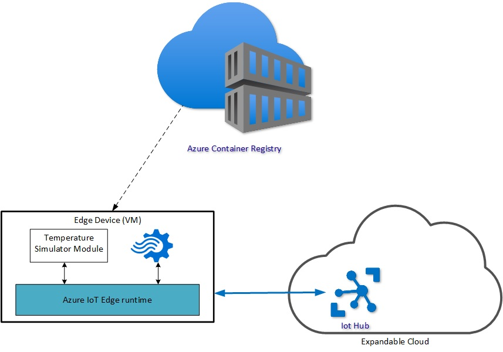

# Introduction to Azure IoT Edge
Contoso has cheese producing factories worldwide. Factories are equipped with production lines have multiple machines to create their cheeses. At the moment they have IoT devices connected to each machine that streams sensor data to Azure and processes all data in the cloud. Due to the large amount of data being collected and urgent time response needed on some of the machines, Contoso's wants to add a gateway device to bring the intelligence to the edge for processing data to the only send important data to the cloud. Plus, be able to process data and react quickly despite local network quality.

You will be setting up a new IoT Edge device that can monitor temperature of one of the machines and deploying a Stream Analytics module to calculate the average temperature and send an alert to the device to act quickly.

## In this lab
In this lab, you will deploy Azure IoT Edge to a Linux VM, connect it to an IoT Hub, add functionality to the Edge Device and add Azure Stream Analytics to the Edge Device.




## Prerequisites
This lab assumes that you have the following resources available:

Resource Type | Resource Name
--------------|--------------
Resource Group | AZ-220-RG
IoT Hub | AZ-220-HUB-*{YOUR-ID}*

### **Exercise 1: Create and Deploy an Azure IoT Edge enabled Linux VM**
In this exercise, you will deploy an Ubuntu Server VM with Azure IoT Edge runtime support from the Azure Marketplace.

- Create an Azure IoT Edge Linux VM from your Azure Portal with the following image: **Ubuntu Server 16.04 LTS + Azure IoT Edge runtime** in your existing Resource Group and give it the following name: **AZ-220-VM-EDGE**.
- Resize the VM to **DS1_v2** and deploy in the same Azure region where your Resource Group is located.
- Enable SSH and use username / password authentication.

> NOTE: You don't have to wait until the VM is deployed, but you can immediately continue with the next exercise.

### **Exercise 2: Create an Azure IoT Edge Device Identity in IoT Hub**
In this exercise, you will create a new IoT Edge Device Identity within Azure IoT Hub using the Azure CLI.

- Run the following Azure CLI command to create an **IoT Edge Device Identity** in Azure IoT Hub with the **Device ID** set to `myEdgeDevice`:
  ```sh
  az iot hub device-identity create --hub-name AZ-220-HUB-{YOUR-ID} --device-id myEdgeDevice --edge-enabled
  ```
- Once the IoT Edge Device Idenity has been created you can access the **Connection String** with:
  ```sh
  az iot hub device-identity show-connection-string --device-id myEdgeDevice --hub-name AZ-220-HUB-{YOUR-ID}
  ```
- Save the connection string for later use

### **Exercise 3: Connect the IoT Edge Device to your IoT Hub**
In this exercise you will connect the IoT Edge Device to Azure IoT Hub
- Connect to your IoT Edge VM through SSH
- Check if the Azure IoT Edge Runtime is installed on the VM by running:
  ```bash
  iotedge version
  ```
- Use the `/etc/iotedge/configedge.sh` script to configure the Edge device with the connection string you saved earlier by running the following command in your VM:
  ```bash
  sudo /etc/iotedge/configedge.sh "{iot-edge-device-connection-string}"
  ```

### **Exercise 4: Add an Edge Module to your Edge Device**
In this exercise you will add a Simulated Temperature Sensor as a custom IoT Edge Module, and deploy it to run on your IoT Edge Device.
- Navigate to your IoT Edge Device inside your Azure Portal on the IoT Hub blade to add a new IoT Edge Module through the **Set modules** command.
- Give your new IoT Edge Module the name **tempsensor**
- Under the Image URI, enter **asaedgedockerhubtest/asa-edge-test-module:simulated-temperature-sensor**
- Enter the following JSON in the **Module Twin Settings** tab to set desired properties to a number of initial values for your simulated temperature sensor:
  ```JSON
  {
    "EnableProtobufSerializer": false,
    "EventGeneratingSettings": {
        "IntervalMilliSec": 500,
        "PercentageChange": 2,
        "SpikeFactor": 2,
        "StartValue": 20,
        "SpikeFrequency": 20
    }
  }
  ```
- Create the newly added module and verify that the **tempsensor** module is added to the deployment manifest with desired properties set
- Verify that the **tempsensor** module is set to **running**
- Check in a Cloud Shell that your newly created module is running on the IoT Edge Device by entering `iotedge list`.
- View the module logs for the **tempsensor** by entering `iotedge logs tempsensor`.
- The Temperature Sensor Module stops after sending 500 messages, but you can restart it by running the command `iotedge restart temperature`.

### **Exercise 5: Deploy Azure Stream Analytics to your Edge Device**
Now that the temperature sensor module is deployed you can add a Stream Analytics module that allows you to process messages on the IoT Edge device before sending them to your IoT Hub.
- Create a storage account with the name **az220store{YOUR-ID}** in the same location where your other services are hosted.
- Set the **Replication** field to **Locally-redundant storage (LRS)**.
- Next create a **New Stream Analytics job**, hosted on your Edge device with the name **AZ-220-ASA-{YOUR-ID}**.
- Configure the Azure Stream Analytics Job
  - Add a stream input with alias **temperature**.
  - Add an output with alias **alert**.
  - Add the following Query:
    ``` SQL
    SELECT  
      'reset' AS command
    INTO
        alert
    FROM
        temperature TIMESTAMP BY timeCreated
    GROUP BY TumblingWindow(second,15)
    HAVING Avg(machine.temperature) > 25
    ```
- Using the Stream Analytics Job blade, configure a storage container to host your Stream Analytics Job by creating a new container with the name **jobdefinition** in the storage account you created before.
- Moving back to your IoT Edge Device inside your Azure Portal on the IoT Hub blade to add a new IoT Edge Module through the **Set modules** command to add the just created Stream Analytics Job.
- Now you need to provide routing information to be able to send the simulated temperatures into the Stream Analytics Job and to send all messages to the IoT Hub
  - Route 1
    - NAME: **telemetryToCloud**
    - VALUE: `FROM /messages/modules/tempsensor/* INTO $upstream`
  - Route 2
    - NAME: **alertsToReset**
    - VALUE: `FROM /messages/modules/AZ-220-ASA-{YOUR-ID}/* INTO BrokeredEndpoint("/modules/tempsensor/inputs/control")`
  - Route 3
    - NAME: **telemetryToAsa**
    - VALUE: `FROM /messages/modules/tempsensor/* INTO BrokeredEndpoint("/modules/AZ-220-ASA-{YOUR-ID}/inputs/temperature")`
- Now you can view the data being send from the Edge device by the `tempsensor` by entering the following command:
  ``` sh
  iotedge logs tempsensor
  ```

  This concludes LAB11. If you want to have more detailed instructions for the lab, complete step-by-step instructions are [available here](https://github.com/MicrosoftLearning/AZ-220-Microsoft-Azure-IoT-Developer/blob/master/Instructions/Labs/LAB_AK_11-introduction-to-azure-iot-edge.md).
