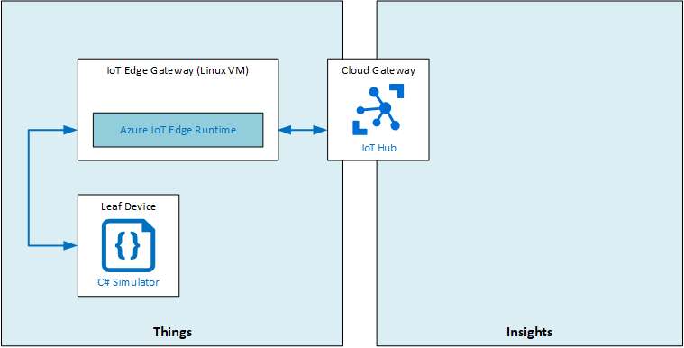

# LAB12 - Setup an Azure IoT Edge Gateway
There are three patterns for using an Azure IoT Edge device as a gateway: [transparent, protocol translation and identity translation](https://docs.microsoft.com/en-us/azure/iot-edge/iot-edge-as-gateway#patterns).

## In this lab
In this lab, you will deploy aAzure IoT Edge to a Linux VM, generate and configure IoT Edge Device CA Certificates, connect an IoT Edge Gatewaye to an IoT Hub and connect a downstream device to your Azure IoT Edge Gateway. This entire scenario allows you to understand and verify the flow of events from leaf to IoT Hub.

The architecture for the lab is incomplete, because the lab does not solve a business problem, but rather helps you to understand the way an IoT Edge Device can be used as a gateway.




## Prerequisites
This lab assumes that you have the following resources available:

Resource Type | Resource Name
--------------|--------------
Resource Group | AZ-220-RG
IoT Hub | AZ-220-HUB-*{YOUR-ID}*

### **Exercise 1: Create and Deploy an Azure IoT Edge enabled Linux VM**
In this exercise, you will deploy an Ubuntu Server VM with Azure IoT Edge runtime support from the Azure Marketplace and will configure this Azure IoT Edge device for use as an Edge Gateway.

- Create an **Azure IoT Edge on Ubuntu** VM through the Azure Portal in your AZ-220-RG resource group and give the vm the following name: **AZ-220-VM-EDGEGW-*{YOUR-ID}***.
- Select **DS1-v2** for the size of your VM.
- Use **paswword** authentication for your VM.
- Make sure you can use **SSH** to remote into your VM.

### **Exercise 2: Generate and Configure IoT Edge Device CA Certificates**
In this exercise, you will generate test certificates using Linux. You will do this on the AZ-220-VM-EDGEGW-{YOUR-ID} Virtual Machine using a helper script.

- Once your newly created Azure IoT Edge VM is up and running, connect to it via SSH from an Azure Cloud Shell
- When you are connected to the Azure IoT Edge VM, clone the following repository to it by providing the following command: `git clone https://github.com/Azure/iotedge.git`.
> NOTE: The certificates you will be generating through a number of helper scripts should only be used for **non-production** use. These certificates should **never** be used on real devices.
- Create a new folder on your Azure IoT Edge VM with the name **lab12** and navigate to it.
- Copy the helper scripts (`iotedge/tools/CACertificates/*.cnf` and `iotedge/tools/CACertificates/certGen.sh`) to your newly created folder.
- Generate a new root and intermediate certificate by running the following script: `./certGen.sh create_root_and_intermediate`.
- Using the same script, now create a device CA certificate and private key by running `./certGen.sh create_edge_device_ca_certificate "MyEdgeDeviceCA"`.
- Make sure that the Azure IoT Edge Runtime is installed on the VM by asking its version number (should be 1.0.8 or higher).
- Using your favorite editor, open the Azure IoT Edge configuration file which can be found here: `/etc/iotedge/config.yaml`. Since the file is initially ready-only, also make sure that you have right access by executing the following command: `sudo chmod a+w /etc/iotedge/config.yaml`.
- Inside the config.yaml file, find the **certificates** section and uncomment it. Add the following certificate files to it (replacing <username> with your username on the Azure IoT Edge Device):
  ```
  certificates:
    device_ca_cert: "/home/<username>/lab12/certs/iot-edge-device-ca-MyEdgeDeviceCA-full-chain.cert.pem"
    device_ca_pk: "/home/<username>/lab12/private/iot-edge-device-ca-MyEdgeDeviceCA.key.pem"
    trusted_ca_certs: "/home/<username>/lab12/certs/azure-iot-test-only.root.ca.cert.pem"
  ```
  and save your changes.
- Exit the SSH connection to the Azure IoT Edge VM, create a new lab12 folder in the Azure Cloud Shell and retrieve the generated certificate files from the Azure IoT Edge VM by entering the following command (replacing username and ipaddress with your particular values): `scp -r -p <username>@<ipaddress>:~/lab12 .`

### **Exercise 3: Create an IoT Edge Device Identiy in IoT Hub using the Azure Portal**
In this exercise, you will use Azure IoT Hub to create a new IoT Edge Device identity for the IoT Edge Transparent Gateway.

- Using the Azure Portal, navigate to your IoT Hub and **Add an IoT Edge device** with the following Device ID: **AZ-220-VM-EDGEGW-*{YOUR-ID}***.
- Make sure that the Authentication type is set to **Symmetric key** with **Auto-generate keys**.
- Copy the **Primary Connection String** of the newly generated Device Identity.
- Define a pass through route by navigating to the **Set module on device blade** and adding the following route:
  - NAME: `route`
  - VALUE: `FROM /* INTO $upstream`

  More information about configuring Azure IoT Edge message routes can be found [in this document](https://docs.microsoft.com/azure/iot-edge/module-composition#declare-routes#declare-routes).
- Apply the changes by creating the route and the Device Identity.

### **Exercise 4: Setup IoT Edge Gateway Hostname**
In order for your Azure IoT Edge VM to act as a Gateway, you will now configure the DNS name for your simulated Edge device and configure the DNS name as the `hostname` of the IoT Edge Gateway VM.
- Navigate to your Azure IoT Edge VM from inside the Azure Portal
- Set its DNS name to **az-220-vm-edgegw-*{your-id}***.
- Save the full DNS name of your Iot Edge Gateway VM
- Connect to your IoT Edge Gateway VM again using SSH (this time you can use the full DNS name instead of the IP address to connect)
- Using your favorite editor, open the Azure IoT Edge configuration file again at: `/etc/iotedge/config.yaml`
- Inside the config.yaml file, find the **Edge device hostname** section and set the hostname to the full DNS name you saved earlier.

### **Exercise 5: Connect the IoT Edge Gateway VM to IoT Hub
In this exercise you will connect the device you created in this lab to your IoT Hub.
- In the Azure Cloud Shell, if you are no longer connected, connect to your IoT Edge Gateway VM again using SSH.
- Execute the following script to connect your Azure IoT Edge Gateway VM to your IoT Hub: `sudo /etc/iotedge/configedge.sh "{iot-edge-device-connection-string}"`. The connection string is the one you saved in Exercise 3 of this lab.
- Verify that your IoT Edge Device is properly running by entering the following command: `iotedge list`. You should see the **edgeHub** and the **edgeAgent** up and running. If you get an error, you can execute **iotedge check --verbose** for troubleshooting.

### ** Exercise 6: Open IoT Edge Gateway VM Device Ports for Communication**
In this exercise, you will configure the Network Security Group (NSG) that secures access to the Azure IoT Edge Gateway from the Internet. The necessary ports for MQTT, AMQP, and HTTPS communications need to be opened so the downstream IoT device(s) can communicate with the gateway.

The IoT communication protocols supported by Azure IoT Edge have the following port mappings:
| Protocol | Port Number |
| -------- | ----------- |
| MQTT | 8883 |
| AMQP | 5671 |
| HTTPS | 443 |
| MQTT + WS (Websocket) | 443 |
| AMQP + WS (Websocket) | 443 |

- Using the Azure Portal, create a new **Inbound security rule** to open port **8883** for the **TCP** protocol with name **MQTT**.
- Add additional rules for AMQP and HTTPS.

### **Exercise 7: Create a Downstream Device Identity in your IoT Hub**
In this exercise, you will create a new IoT Device identity in Azure IoT Hub for the downstream IoT device (leaf device). This device identity will be configured so that the Azure IoT Edge Gateway is a parent device for this downstream device.
- Using the Azure Portal, navigate to your IoT Hub and **Add an IoT device** with the following Device ID: **DownstreamDevice1**.
- Make sure that the Authentication type is set to **Symmetric key** with **Auto-generate keys**.
- Select your Azure IoT Edge Gateway VM as **parent device**.
- Copy the **Primary Connection String** of the newly generated Device Identity.

### **Exercise 8: Connect your Downstream Device to your IoT Edge Gateway VM**
In this exercise, you will configure a pre-built Downstream Device to connect to the IoT Edge Gateway.
- Using the Azure Cloud Shell, copy the root CA X.509 certificate to your local development machine by entering the following command: `download lab12/certs/azure-iot-test-only.root.ca.cert.pem`.
- Copy the certificate to the /LabFiles directory for this lab.
- Using Visual Studio Code, in the /LabFiles folder for this lab, open the SimulatedDevice.scproj file.
- Open the SimulatedDevice.cs file and add the IoT Hub connection string to it. To make this a downstream device that communicates through the IoT Edge Gateway, and append `;GatewayHostName=<full DNS Name of the IoT Edge Gateway VM>` to it.
- Review the source code of the simulated device, check where the X.509 certificate will be installed and look at the device telemetry messages being send from the simulated device.
- Run the simulated device from within the Visual Studio Code terminal by entering the command `dotnet run`.
- Verify that the simulated device is sending telemetry messages and leave the simulated device running.

### **Exercise 9: Verify the Event Flow**
In this exercise, you will use the Azure CLI to monitor the events being sent to Azure IoT Hub from the downstream IoT Device through the IoT Edge Gateway. This will validate that everything is working correctly.
- Start an Azure Cloud Shell from the Azure Portal and monitor events for your Event Hub.
- When everything is working correctly, you will see output from the downstream device, which is send through unmodified by the Azure IoT Edge Gateway VM.
- Exit the console application and optionally clean up your resources to limit consuming Azure services.

This concludes LAB12. If you want to have more detailed instructions for the lab, complete step-by-step instructions are [available here](https://github.com/MicrosoftLearning/AZ-220-Microsoft-Azure-IoT-Developer/blob/master/Instructions/Labs/LAB_AK_12-setup-an-iot-edge-gateway.md).

