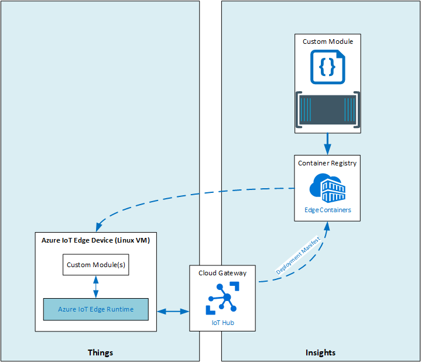

# LAB13 - Develop, Deploy and Debug a custom module on Azure IoT Edge with Visual Studio Code

## Lab Scenario

Often, decisions must be made at the Intelligent Edge. For instance, if you have a conveyor belt that packs products, you probably need continous insights in the number of products being packed. For this, you could develop a simple module that counts the number of packages being transported on the conveyor belt (on the HW level maybe through a light sensor, although that is not part of this LAB). Such a module is an excellent candidate to run on an Azure IoT Edge device.

## In this lab
In this lab, you will create an Azure Container Registry to host custom Azure IoT Edge modules, create and customize an Azure IoT Edge module and debug it using the Azure IoT Edge Simulator. Finally you will deploy your custom IoT Edge Module.

The next figure show the high level architecture, focussing on custom Azure IoT Edge modules. This architecture is incomplete, since it show only a subset of an entire IoT solution. However, the architecture is helpful to understand how custom modules can be deployed to Azure IoT Edge devices.




## Prerequisites
This lab assumes that you have the following resources available:

Resource Type | Resource Name
--------------|--------------
Resource Group | AZ-220-RG
IoT Hub | AZ-220-HUB-*{YOUR-ID}*

Also, you need to have the complete set of development tools installed. In [this Hands-on-Lab description](https://github.com/MicrosoftLearning/AZ-220-Microsoft-Azure-IoT-Developer/blob/master/Instructions/Labs/LAB_AK_03-set-up-the-development-environment.md), you can find the up-to-date list of development tools needed.

### **Exercise 1: Install Azure IoT EdgeHub Dev Tools**
To be able to develop and debug Azure IoT Edge Modules, you need to install the Azure IoT EdgeHub Dev Tool. It provides a local development experience with a simulator for creating, developing, testing, running, and debugging Azure IoT Edge modules and solutions. More information can be [found here](https://pypi.org/project/iotedgehubdev/).
- If you don't have pip (package manager for Python) installed yet, install it by entering the following command in a command prompt:
  ```
  curl https://bootstrap.pypa.io/get-pip.py -o get-pip.py
  python get-pip.py
  ```
- To install the Azure IoT EdgeHub Dev Tool, enter the following command in the same command prompt:
  ```
  pip install iotedgehubdev
  ```

### **Exercise 2: Create an Azure Container Registry**

The Azure Container Registry (ACR) provides storage of private Docker images for container deployments. As such, it is a great service to store containerized Azure IoT Edge modules.

- From within the Azure Portal, create a new Azure Container Registry in your Lab's resource group, in the same region where you deploy all your services and give the Azure Container Registry the following name:
 __AZ220ACR__***{YOUR-ID}***.
 - Make sure to **Enable** under **Admin user** and select a **Standard** SKU.
 - Copy the values for **Login server**, **Username** and **password**.
 - Inside the command prompt you opened in Exercise 1, enter the following command to login to your ACR:
   ```
   docker login --username <username> --pasword <password> <loginserver>
   ```

### **Exercise 3: Create a Custom Edge Module in C#**

In this exercise, you will create an Azure IoT Edge Solution with a custom C# Azure IoT Edge Module.
- Open Visual Studio Code and create a **New IoT Edge Solution** with the name **EdgeSolution**, followed by selecting a **C# Module**. Give your C# module the name **ObjectCountingModule**.
- Replace the Docker image repository from ```localhost:5000``` to your ACR server name.
- When Visual Studio Code opens your solution, load required resources and/or the C# extension.
- In the **.env** file, replace the plaeholders for **Registry name** with your ACR username and **password** with your ACR password.
- Verify that all modules needed are present in the **deployment.template.json** manifest file.
- Select **amd64** as default target platform for your edge solution through the Visual Studio Code command palette.
- Take a look at the Program.cs file and review its functionality.

### **Exercise 4: Verify your IoT Edge Module by running it into the IoT Edge Simulator**

Now you will build and run your custom IoT Edge Module using the IoT Edge Simulator from within Visual Studio Code.
- Using the Azure Portal, retrieve the IoT Hub **Connection string**.
- Using the Azure Portal, navigate to your IoT Hub and **Add an IoT Edge device** with the following Device ID: **SimulatedDevice**.
- Make sure that the Authentication type is set to **Symmetric key** with **Auto-generate keys**.
- Inside Visual Studio Code, right-click the **deployment.debug.template.json** file and then click **Build and Run IoT Edge Solution in Simulator**.
- Click **Setup** in the **setup iotedgehubdev** prompt and provide the **Connection string** you retrieved earlier in this exercise.
- When prompted to **Select an IoT Edge Device**, click **SimulatedDevice**.
- Using the **deployment.debug.template.json** manifest file, select **Build and Run IoT Edge Solution in Simulator**.
> NOTE: If you get an error while trying to run the IoT Edge solution in the Simulator, you should try to connect manually to the IoT Edge Simulator using the Visual Studio Command Palette.
- When your solution is up and running, you can see messages in Visual Studio Code's output Windows. To verify that telemetry is also received in your IoT Hub, open an Azure Cloud Shell and enter the following command: ```az iot hub monitor-events --hub-name AZ-220-HUB-{YOUR-ID}```

### **Exercise 5: Debug in Visual Studio Code's Attach Mode with the IoT Edge Simulator**
In this exercise you will get familair with remote debugging capabilities for Azure IoT Edge Modules using Visual Studio Code.
- Inside Visual Studio Code open the debugger from the left hand side menu and make sure that your module is selected for remote debugging.
- Start debugging and attach to the following process: **dotnet ObjectCountingModule.dll**.
- Set a breakpoint on the entry point of the ```PipeMessage``` method and observe some variable values in the Visual Studio Code debugger view.
- To stop debugging, click the **Disconnect** button or press **Shif + F5**.
- Stop the IoT Edge Simulator through the Visual Studio Code **Command Palette**.

### **Exercise 6: Deploy your IoT Edge Solution**
After succesfully debugging your custom IoT Edge Module, you can now publish it into your Azure Container Registry to make it available to be deployed to any Azure IoT Edge device.
- Inside Visual Studio Code, right click the **deployment.template.json** and then click **Build and Push IoT Edge Solution**. After building, this will publish your custom IoT Edge Module to the Azure Container Registry.
- In the Azure Portal, check if you can find your custom Azure IoT Edge module in the ACR repository and validate the tagname.
- IN the Azure Portal, now navigate to your Azure IoT Hub to create a new Azure IoT Edge device with identity **objectcountingdevice**. 
- Make sure that the Authentication type is set to **Symmetric key** with **Auto-generate keys**.
- Navigate to the newly created **objectcountingdevice** and enter your ACR details under **Container Registry Settings**.
- Using **Set modules on device** add your custom IoT Edge Module, using the following format:
  ```
  <container-registry-login-server>/repository-name>:<tag>
  ```
- Now remove the default route on the **Routes** tab and replace it by the two following routes:
  | name | value |
  | ---- | ----- |
  | AllMessagesToObjectCountingModule | ``` FROM /* INTO BrokeredEndPoint("/modules/objectcountingmodule/inputs/input1")``` |
  | ObjectCountingModuleToIoTHub | ``` FROM /messages/modules/objectcountingmodule/outputs/* INTO $upstream``` |
- At the bottom of the blad, click **Next: Review + Create**.

This concludes LAB13. If you want to have more detailed instructions for the lab, complete step-by-step instructions are [available here](https://github.com/MicrosoftLearning/AZ-220-Microsoft-Azure-IoT-Developer/blob/master/Instructions/Labs/LAB_AK_13-deploy-and-debug-custom-azure-iot-edge-module.md). 