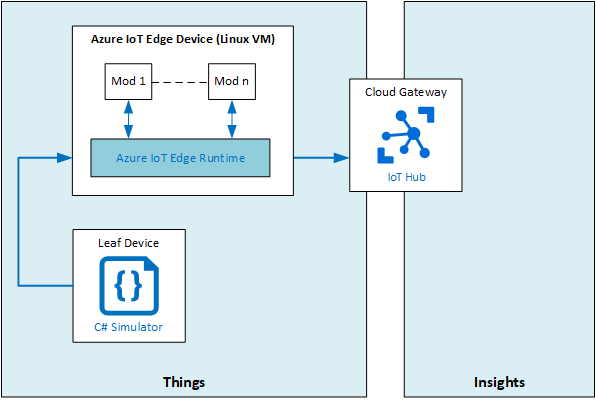

# LAB14 - Run an IoT Edge device in a restricted network and offline

## Lab Scenario

The conveyor belt that you have previously implemented is paying off. It sends telemetry data to your Azure IoT Hub to manage inventory and to monitor the belts. Now you need to optimize the system to load-balance network usage and to allow operation when the network connection drops entirely.

## In this lab
In this lab, you will host your Azure IoT Edge Gateway in a Linux VM, connect leaf devices to it, configure local storage on your Azure IoT Edge Device and test connectivity and offline support.

The next figure show the high level architecture.

## Prerequisites
This lab assumes that you have the following resources available:

Resource Type | Resource Name
--------------|--------------
Resource Group | AZ-220-RG
IoT Hub | AZ-220-HUB-*{YOUR-ID}*
IoT Leaf Device | SimulatedThermostat (see LabFiles)

> NOTE: To make sure that the right certificates will be installed and to make sure that you have the correct modules running in your Azure IoT Edge device, we create a new Azure IoT Edge Gateway rather than reusing the gateway device we used in Lab12 and/or Lab13.

